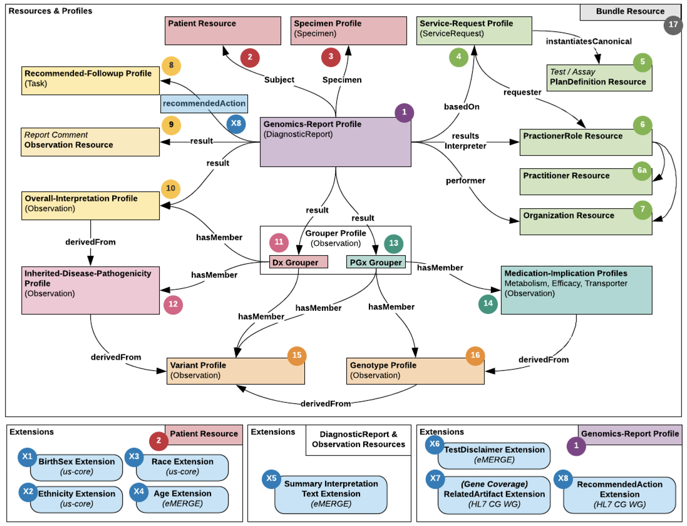

.. _artifacts:

Artifacts
=========
Figure 5 below illustrates a complete map of the resource, profile and extension FHIR artifacts used to support the eMERGE report
defined by this specification. It starts at the center with #1 the GenomicsReport profile in purple from the FHIR CG Genomics Reporting IG.
At the top are the red artifacts representing the patient and specimen concepts. The light green
artifacts in the upper right hand side represent the order (Service-Request) and the ordered assay (PlanDefinition) along with the ordering and performing practitioners and their facility.
The yellow artifacts on the left-hand side represent the top-level interpretation, comments and recommended actions, if applicable.
The bottom half of the mapping diagram divides the diagnostic disease gene panel findings and results in pink on the left from the
pharmacogenomic gene panel findings and results in green on the right. Both results and findings share common artifacts in orange at the
bottom of the diagram to represent the variants and genotypes associated with the findings and results.

   **Figure 5: Artifact Catalog Map**
   A map of the associations between the major schema artifacts (resources, profiles and extensions).

The additional sub-diagrams at the bottom of Figure 5 contain the complete set of extensions utilized in this specification. These
extensions were used from other sources when available as indicated or created as custom extensions if no reasonable alternative was
available. These extensions primarily are used to extend the Patient (X1 thru X4) and GenomicsReport (X6 thru X8) concepts, but one
extension was needed for capturing summary interpretation text (X5) on both the GenomicsReport and/or any Observation.

The following catalog provides a tabular view corresponding to the numbers in Figure 5 as well as the figures shown elsewhere in this specification.
The links will open the specific artifact's page in this specification.

.. list-table::
   :class: my-wrap
   :header-rows: 1
   :align: left
   :widths: auto

   * - No.
     - Artifact
     - FHIR Resource
     - Description
   * - 1
     - :ref:`Genomics-Report <genomics_report>`
     - DiagnosticReport
     - The top level resource representing the genetic test results report with the final findings and interpretations for the eMERGE Test Panel.
   * - 2
     - :ref:`Patient <patient>`
     - Patient
     - The patient for which the eMERGE Test Panel was ordered and fulfilled.
   * - 3
     - :ref:`Specimen <specimen>`
     - Specimen
     - The sample or specimen collected from the patient being tested.
   * - 4
     - :ref:`Service-Request <service_request>`
     - ServiceRequest
     - The fulfilled order for a patient along with the ordering practitioner, the specimen and the assay methodology and description performed.
   * - 5
     - :ref:`(Assay) PlanDefinition <plan_definition>`
     - PlanDefinition
     - The plan definition resources is used to represent the eMERGE lab developed test (LDT) performed.
   * - 6
     - :ref:`PractitionerRole <practitioner_role>`
     - PractitionerRole
     - The practitioner role is used to represent the health care personnel in the context of their role and organization (e.g. geneticists, clinicians, etc..).
   * - 6a
     - :ref:`Practitioner <practitioner>`
     - Practitioner
     - The practitioner is either the individual health care provider playing the role of an ordering physician or result interpreter when paired with the organization and practioner role.
   * - 7
     - :ref:`Organization <organization>`
     - Organization
     - The organization for the ordering provider, results interpreter and performing lab.
   * - 8
     - :ref:`Recommended-Followup <recommended_followup>`
     - Task
     - The recommended followup profile is a proposed task resource for structuring the return of recommendations for the report.
   * - 9
     - :ref:`Report Comment <report_comment>`
     - Observation
     - A generalized observation used by the performing lab to convey unstructured and uncoded comments about the report.
   * - 10
     - :ref:`Overall-Interpretation <overall_interpretation>`
     - Observation
     - The overall interpretation for the diagnostic gene panel portion of the assay relative the primary indication for testing.
   * - 11
     - :ref:`Dx Grouper <grouper_dx>`
     - Observation
     - The grouping of diagnostic gene panel results to separate them from the PGx results and/or other logical groupings of results.
   * - 12
     - :ref:`Inherited-Disease-Pathogenicity <inh_dis_path>`
     - Observation
     - The inherited disease pathogenicity interpretations for specific variant findings assessed in relation to the primary indication for testing which have the potential to also be secondary findings.
   * - 13
     - :ref:`PGx Grouper <grouper_pgx>`
     - Observation
     - The grouping of PGx gene panel results to separate them from the diagnostic gene panel results.
   * - 14
     - :ref:`Medication-Implication <medication_implication>`
     - Observation
     - The 3 types of medication implications: Metabolism, Efficacy, Transporter function interpretations used to assess PGx gene panel variant findings.
   * - 15
     - :ref:`Variant <variant>`
     - Observation
     - The variant profile supports the return of structured short sequence variants along with their zygosity for observed findings typically to support interpretations related to their clinical significance or in the context of the assay.
   * - 16
     - :ref:`Genotype <genotype>`
     - Observation
     - The genotype profile supports the return of structured genotypes derived from individual variant alleles. This is used primarily to structure PGx diplotypes.
   * - X#
     - :ref:`Extensions <extensions>`
     - Extension
     - The list of all extensions used throughout this specification with special emphasis on the few custom extensions developed by eMERGE to support the project's requirements.

.. toctree::
   :hidden:

   genomics_report
   patient
   specimen
   service_request
   plan_definition
   practitioner_role
   practitioner
   organization
   recommended_followup
   report_comment
   overall_interpretation
   grouper_profile
   inherited_disease_pathogenicity
   med_implication
   variant
   genotype
   extensions
