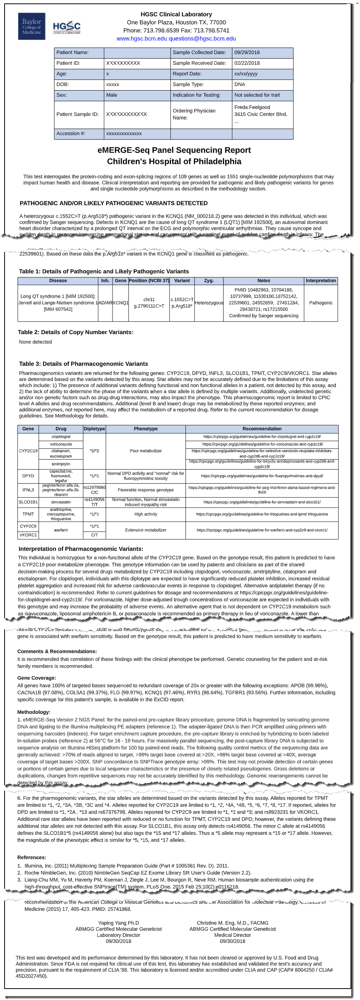
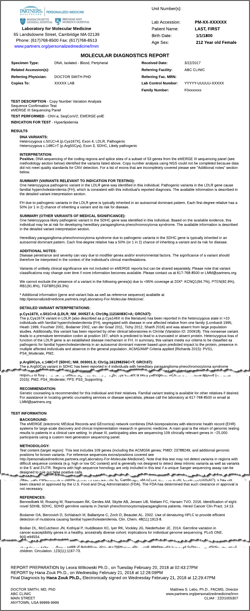
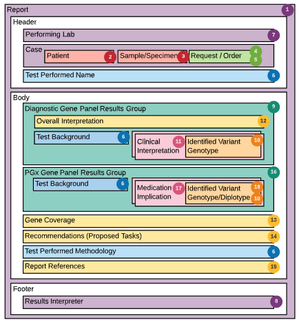
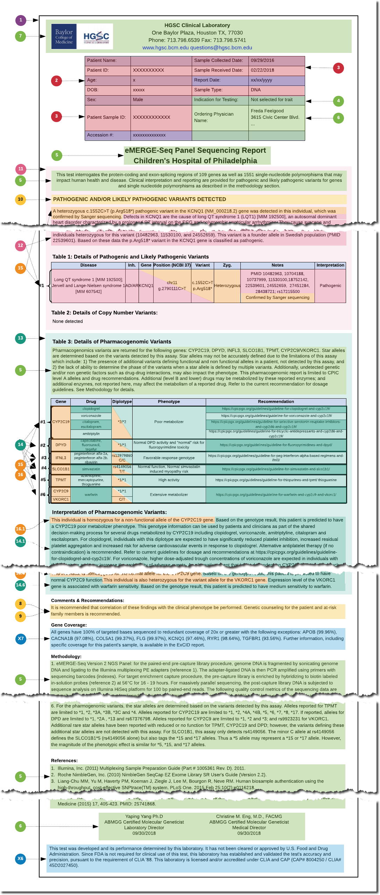
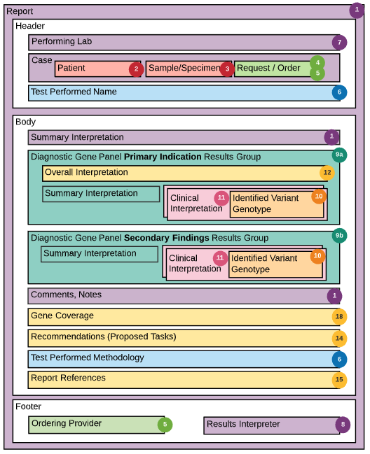
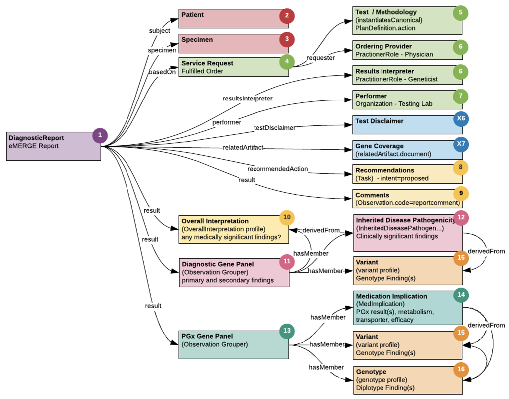

.. _design:

Design
=======

.. Warning::
    This document is a work in progress and is not ready for production use.

.. sidebar:: Contents

    * :ref:`rept-examples`
    * :ref:`rept-struct`
    * :ref:`fhir-rept-resources`

The eMERGE III electronic return of structured results project is motivated by several key design principles:

1. **All content in narrative report is structurally represented.**
   All lab produced content from the narrative reports should be captured in structured forms so that it is possible to reconstruct the it.
2. **Codify concepts when reasonable.**
   Drugs, diseases, genes, etc... should be codified based on FHIR and IG guidance. eMERGE concepts that extend beyond the FHIR and IG guidance should be codified if possible and within reason.
3. **Computationally Reliable representation of results**
   TODO <add a general statement about aiming to achieve computationally useful representations, when possible>
4. **Reflect the composite nature of results**
   Structure & codify both diagnostic primary/secondary disease pathogenicity interpretations and pharmacogenomic genotype finding medication implications.
5. **Representation of assay and case level gene coverage.**
   Use text based assay definition, gene coverage and methodology description per lab. Include computational gene coverage report artifact if available.
6. **Attempt to enable Clinical Decision Support**
   Support for computationally reliable sharing of short sequence variation, genotypes, diplotypes, large deletion/insertion/duplication (deferred CNVs).

.. _rept-examples:

Example Reports
-----------------

The eMERGE reporting process is supported by two separate clinical workflows at the
corresponding sequencing centers (SCs); The HGSC Lab at Baylor College of Medicine and
The LMM Lab at Partners Healthcare (in conjunction with Broad Institute).

Below are two example (deidentified) positive reports one from each of the two SCs.

.. rst-class:: clearsidebyside

**Figure 1:** HGSC & LMM eMERGE Report Examples (click to enlarge)

This section introduces the process used to convert and map these two similar reports into a common HL7 FHIR structure.

.. _rept-struct:

Report Layout & Structure
--------------------------

The subsections below show figures containing a general report model alongside an
example report with all of the detailed elements mapped using coloring and numbered call outs.
Each subsection represents one of the two SC report designs shown in the preceding section.
This structuring and mapping exercise was thoroughly reviewed and vetted by users at
each of the two SCs.

HGSC Report Structure
^^^^^^^^^^^^^^^^^^^^^^^^^^

TODO <add a brief description of the common vs different elements from that of LMM>

The HGSC general report layout and detailed mapping to their example report...

.. rst-class:: clearsidebyside

**Figure 2:** HGSC general report layout and detailed mapping (click to enlarge)

LMM Report Structure
^^^^^^^^^^^^^^^^^^^^^^^^^

TODO <add a brief description of the common vs different elements from that of HGSC>

The LMM general report layout and detailed mapping to their example report...

.. figure:: _images/lmm-report-mapped.png
   :alt: LMM eMERGE Example Report Detailed Mapping
   :height:  600 px
   :class: sidebyside

.. rst-class:: clearsidebyside

**Figure 3:** LMM general report layout and detailed mapping (click to enlarge)

.. _fhir-rept-resources:

FHIR Report Schema & Resources
------------------------------

   **Figure 4: FHIR Diagnostic Report Schema Alignment**
   An illustration of the associations between the major report components and FHIR Diagnostic Report Schema.

FHIR Mapping
----------------

TODO <discuss the process for mapping CG IG profiles and FHIR resources to elements.>
          <and mention the decision to follow the Genomics Reporting IG vs starting from scratch>

Genomics Reporting Guidance from IG
^^^^^^^^^^^^^^^^^^^^^^^^^^^^^^^^^^^
The eMERGE results FHIR is based on the Genomics Reporting profile and guidance from the |fhir-gr-ig|.

This specification aims to harmonize and leverage the draft work of the HL7 CG WG to both validate and inform its development.
In cases where there are gaps or requirements that are unclear or unmet, they are raised with the HL7 CG WG and
custom extensions or profiles are developed to fill the missing needs with the expectation that these issues
will ultimately be reconcilable as the standard matures.

The table below lists the eMERGE report components and their preferred alignment
based on the HL7 CG Genomics Reporting IG specification. For components that do not
align cleanly alternative solutions are provided including but not limited to the
introduction of custom extensions. The following section on Artifacts has a comprehensive
catalogue of every resource, profile and extension used by this eMERGE specification.

.. list-table::
   :class: my-wrap
   :header-rows: 1
   :align: left
   :widths: auto

   * - No.
     - Element
     - FHIR Resource
     - IG Profile/Ext
     - Related Properties
   * - 1
     - Report
     - |diagnosticreport-res|
     - |genomics-report-prof|
     - | Test Disclaimer,
       | Gene Coverage
   * - 2
     - Patient
     - |patient-res|
     - none
     -
   * - 3
     - Sample / Specimen
     - |specimen-res|
     - |specimen-prof|
     -
   * - 4
     - Request / Orderer
     - |servicerequest-res|
     - |service-request-prof|
     -
   * - 5
     - Test Performed ...
     - |plandefinition-res|
     - none
     - | ...Name,
       | ...Background,
       | ...Methodology,
       | ...References
   * - 6
     - | Ordering Provider,
       | Results Interpreter
     - |practitionerrole-res|
     - none
     -
   * - 7
     - Performing Lab
     - |organization-res|
     - none
     -
   * - 8
     - Recommendations (Proposed)
     - |task-res|
     - |recommended-followup-prof|
     -
   * - 9
     - Comments (Additional Notes)
     - |observation_res|
     - none
     -
   * - 10
     - Overall Interpretation
     - |observation-res|
     - |overall-interp-prof|
     - Summary Text
   * - 11
     - Diagnostic Gene Panel Results Group
     - |observation-res|
     - |grouper-prof|
     - Summary Text
   * - 12
     - Clinical Interpretation
     - |observation-res|
     - |inh-dis-path-prof|
     -
   * - 13
     - PGx Gene Panel Results Group
     - |observation-res|
     - |grouper-prof|
     -
   * - 14
     - Medication Implication
     - |observation-res|
     - | |metab-impl-prof-abbr|,
       | |transport-impl-prof-abbr|,
       | |efficacy-impl-prof-abbr|
     -
   * - 15
     - Identified Variant Genotype
     - |observation-res|
     - |variant-prof|
     -
   * - 16
     - Identified Variant Diplotype
     - |observation-res|
     - |genotype-prof|
     -
   * - X5
     - Summary Text
     - none
     - custom
     -
   * - X6
     - Test Disclaimer
     - none
     - custom
     -
   * - X7
     - Gene Coverage
     - none
     - |related-artifact-ext|
     -
