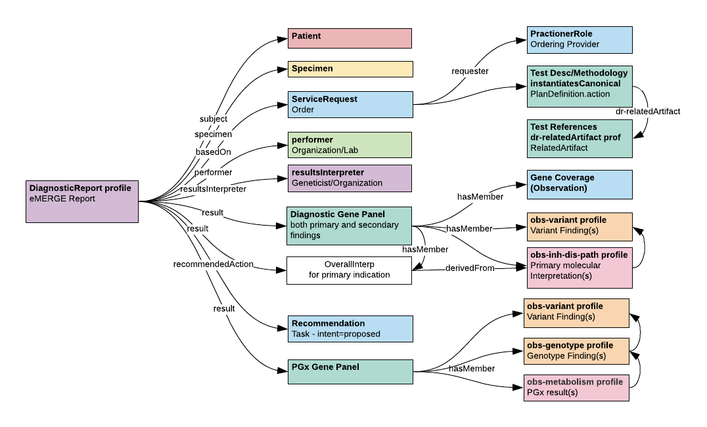

Schema
======

The eMERGE results FHIR schema is based on the Diagnostic Report Resource profile and guidance from the
[HL7 CG WG Implementation Guide on General Genomic Reporting](http://build.fhir.org/ig/HL7/genomics-reporting/general.html).

This specification aims to harmonize and leverage the draft work of the HL7 CG WG to both validate and inform its development.
In cases where there are gaps or requirements that are unclear or unmet, they are raised with the HL7 CG WG and
custom extensions or profiles are developed to fill the missing needs with the expectation that these issues
will ultimately be reconcilable as the standard matures.

   **Figure: Schema Overview**
   An illustration of the associations between the major schema components.

Each major component is described in detail in the corresponding sub-sections.

.. toctree::
   :maxdepth: 1

   report
   patient
   specimen
   service_request
   performer_and_results_interpreter
   diagnostic_gene_panel
   overall_interpretation
   gene_coverage
   recommendation
   pgx_gene_panel
   variant_and_genotype
   inherited_disease_pathogenicity
   drug_implication
